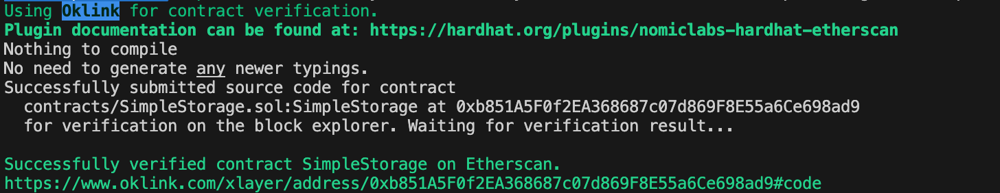

# @okxweb3/hardhat-explorer-verify

[English](./README.md)
[Chinese](./README_ZH.md)

## Background

The `@okxweb3/hardhat-explorer-verify` plugin is designed for the Hardhat framework to verify smart contracts deployed on the OKX Chain XLayer. This plugin focuses on verifying that the deployed contract code matches the original source code, thus enhancing the transparency and trustworthiness of smart contracts. Users can utilize this plugin to verify their contracts on the OKX Chain blockchain explorer without the need for manual submissions.

## Features

- **Automated Verification**: Simplifies the verification process by automatically extracting contract information from the Hardhat project and submitting it to the OKX Chain explorer.
- **Security**: Ensures that the deployed contracts are identical to the source code, enhancing contract security.
- **Ease of Use**: The integration is straightforward, requiring minimal configuration to get started.

## Installation

To install this plugin in your Hardhat project, use the following command:

```bash
npm install @okxweb3/hardhat-explorer-verify
```

## Usage

1. **Install the Plugin**: As described in the installation section, first install the `@okxweb3/hardhat-explorer-verify` plugin in your project.

2. **Configure Hardhat**: In your Hardhat configuration file (usually `hardhat.config.js` or `hardhat.config.ts`), import and configure the plugin. Ensure your network configuration and API keys are correctly set.

   Here is a sample configuration:

   ```javascript
   import { HardhatUserConfig } from "hardhat/config";
   import "@nomicfoundation/hardhat-toolbox";
   import '@okxweb3/hardhat-explorer-verify';  // Import the plugin

   const config: HardhatUserConfig = {
     solidity: "0.8.24",
     sourcify: {
       enabled: true,
     },
     networks: {
       xlayer: {
         url: "https://xlayerrpc.example.com",
         accounts: ["<Your Wallet Private Key>"],
       },
     },
     etherscan: {
        apiKey: '...'
     },
     okxweb3explorer: {
       apiKey: "<Your API Key>",
     }
   };

   export default config;
   ```

3. **Verify Contracts**: After deploying the contracts, use Hardhat to run the verification script. This typically involves running a specific Hardhat task that automatically fetches contract data and submits it to the OKX Chain explorer for verification.

   Example command:

   ```bash
   npx hardhat okverify --network xlayer <Your Contract Address>
   ```

4. **View Verification Results**: Once verification is successful, you can view the verification status and the contract code on the OKX Chain blockchain explorer.



This document is designed to help developers effectively use the `@okxweb3/hardhat-explorer-verify` plugin. If you have questions or need further assistance, feel free to submit issues to the project's GitHub repository.